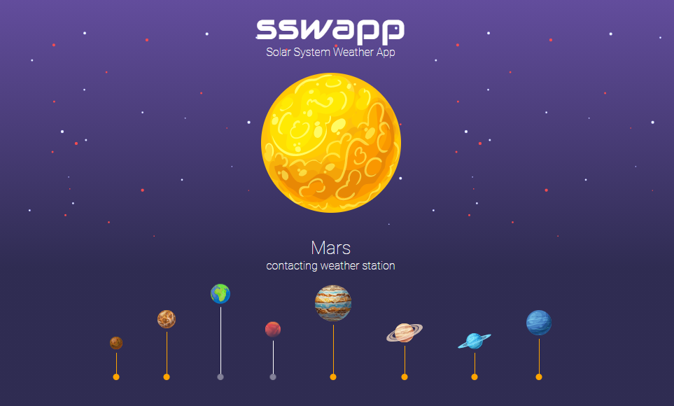
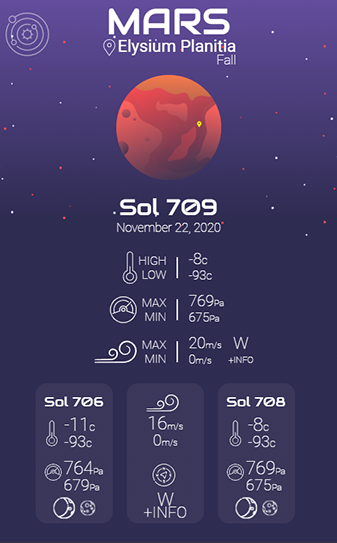
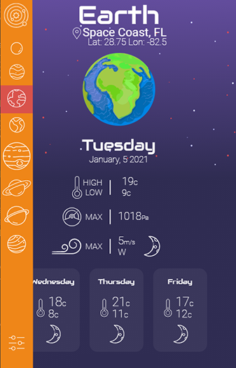
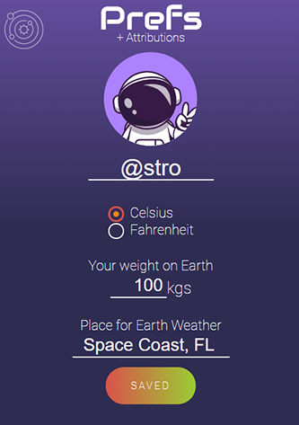
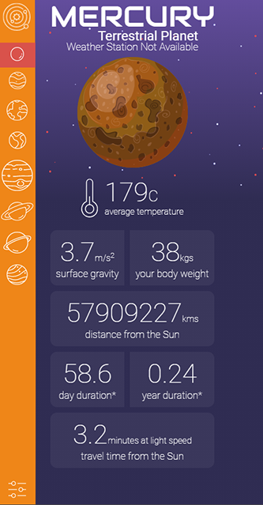

## **SSWAPP**

### **S**olar **S**ystem **W**eather **A**pp

Weather Forecast for the Space Traveler

---

## Mars Weather

NASA’s InSight Mars lander takes continuous weather measurements (temperature, wind, pressure) on the surface of Mars from the Elysium Planitia; a flat, smooth plain near Mars’ equator.

To learn much more about this cool mission check [this link](https://mars.nasa.gov/insight/timeline/overview/)

This App shows weather data for the latest 4 Sols (Martian days) _with available temperature data_. Since data travels from Mars to Earth sometimes it is incomplete or unavailable. When more data from a particular Sol is downlinked (sometimes several days later), these values are recalculated and get updated.

The InSight Mars Mission data is provided by the NASA Jet Propulsion Laboratory and Cornell University API.
UPDATE: InSight has temporarily suspended daily temperature measurements. Until more data becomes available, it will appear the weather for January 11, 2021

---

## Earth Weather

Earth weather forecast data thanks to Open Weather API. Go and check them out at [Open Weather Map](https://www.openweathermap.org)

### :point_up_2: Changing Earth location

Click the _preferences_ button to select a different place to get its weather.

---

## Preferences

On this screen you can change:

- Your nickname
- Unit preference (Celsius or Fahrenheit)
- Your weight on Earth (updates on all other planets)
- The location to get your weather forecast

---

## Planetary Data</h3>

Planetary information thanks to NASA’s Solar System Website: go and check it out to learn tons of cool stuff about our [solar system](https://solarsystem.nasa.gov/planets/overview/#otp_planet_lineup)

---

## Web Service Rate Limits

As all these awesome APIs are free to use, limits are placed on the number of requests you can make. To keep these requests as low as possible, SSWAPP updates weather data on a daily basis.
